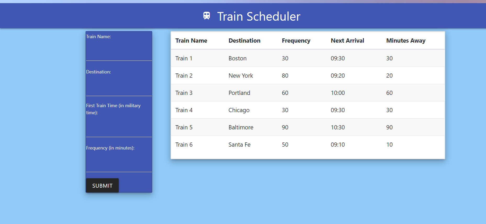

# Train_Scheduler
This application allows the user to add trains along with their destination, start time and frequency.  This information is used to determine the next available train and displays this information in a table on the page.

This application utilizes moment.js to determine times and materialize to build the "look and feel" of the site.

Deployed project: https://bethgrogg.github.io/Train_Scheduler/